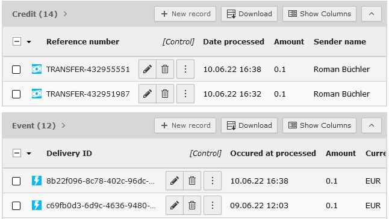

.. include:: /Includes.rst.txt

.. image:: https://poser.pugx.org/buepro/typo3-wise/v/stable.svg
   :alt: Latest Stable Version
   :target: https://extensions.typo3.org/extension/wise/

.. image:: https://img.shields.io/badge/TYPO3-11-orange.svg
   :alt: TYPO3 11
   :target: https://get.typo3.org/version/11

.. image:: https://poser.pugx.org/buepro/typo3-wise/d/total.svg
   :alt: Total Downloads
   :target: https://packagist.org/packages/buepro/typo3-wise

.. image:: https://poser.pugx.org/buepro/typo3-wise/d/monthly
   :alt: Monthly Downloads
   :target: https://packagist.org/packages/buepro/typo3-wise

.. image:: https://github.com/buepro/typo3-wise/workflows/CI/badge.svg
   :alt: Continuous Integration Status
   :target: https://github.com/buepro/typo3-wise/actions?query=workflow%3ACI

.. _introduction:

============
Introduction
============

.. _introduction-screenshots:

Screenshots
===========

   Event and credit records

.. _ introduction-console-commands:

Console commands
================

Following a view sample commands are presented. More examples can be found in
the :ref:`user manual <user-manual-console>`.

.. code-block:: shell
   :caption: Get credit transactions for all sites and all profile id's. The from time is derived from the last transaction record. In case no record is available the from time is one month back from now.

   path/to/bin/typo3 wise:getcredits

.. code-block:: shell
   :caption: Get credit transactions for the period 06.05.2022 - now

   path/to/bin/typo3 wise:getcredits -f 06.05.2022
